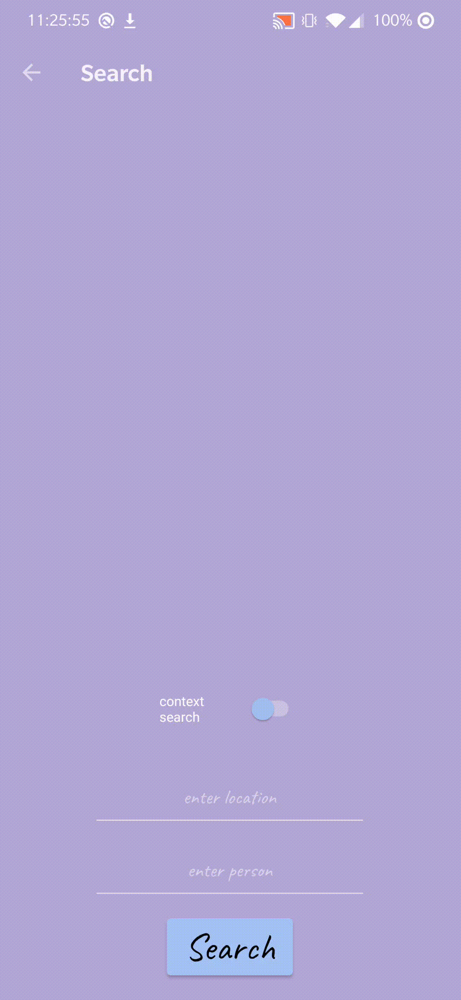

# SnapVault (Mobile)
Welcome to my mobile app guide. All the features are listed below. Feel free to roam around!

*[shortcut to the source code](./app/src/main/java/com/example/android/)*

**NOTE:**  
*As of now, the mobile app is only available for android devices.*

## Overview
SnapVault gives you the power to create and manage albums directly from images stored on your device. You can move and copy photos between your albums. You can tag the people and locations in your photos. You can even view your collection with a built-in slideshow. This mobile version even lets you search for photos by their tags. 

Unlike the desktop application, the mobile version only supports a single user. This was a deliberate design decision. 

<!---
cut frames of gifs
-->

## Implementation
This application was written in java using [Android Studio](https://developer.android.com/studio)

## Data Management
Data persistence is achieved through [shared preferences](https://docs.oracle.com/javase/tutorial/jndi/objects/serial.html).

Photos are stored as [bitmaps](https://developer.android.com/reference/android/graphics/Bitmap).

## Albums
Click open, and let the adventure begin! You can easily add, delete or rename albums. 

<!---

-->

### Open
Opening an album allows you to select individual photos.

#### Add
Add a photo to the open album from your computer.

<!---

-->

#### Move
Move a photo from the open album to another album.

<!---

-->

#### Delete
Delete a photo in the open album.

<!---

-->

## Display
After opening an album and selecting a photo, you can display that photo and navigate through the entire album in a slideshow.

<!---

-->

### Tag
Tag your photos by people

<!---

-->

and location.  

## Search
Search allows you to sort photos by people or location tags. 
<!---

-->

Turn on "*context search*" to return similar matches!

# Credits

