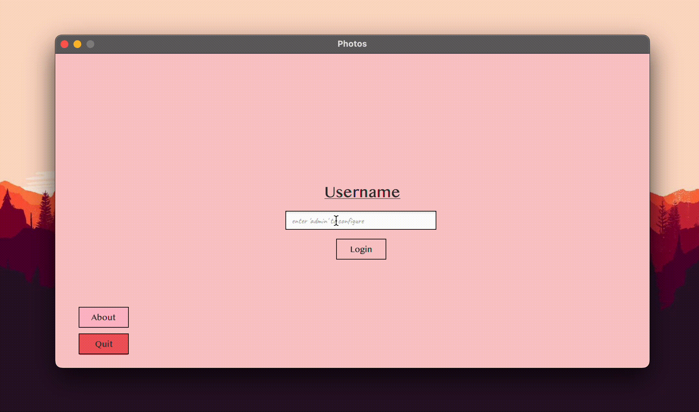
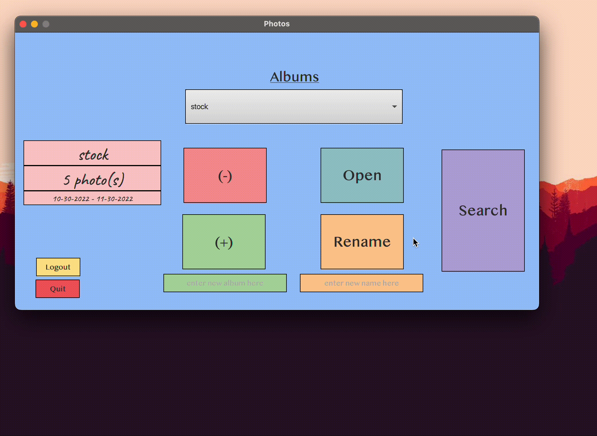

# Photo Library (Desktop)
Welcome to my desktop app guide. All the features are listed below. Feel free to roam around!

*[shortcut to the source code](./src/main/java/com/example/bro_comm/)*
## Overview
Photo Library gives you the power to create and manage albums directly from images stored on your computer. You can move and copy photos between your albums. You can edit your photos with captions and tags. You can even view your collection with a built-in slideshow. Above all, it supports multiple users! 

This application comes preconfigured with a stock user containing a stock album with five breathtaking stock photos.

<!---
cut frames of gifs
-->

## Implementation
This application was written in java using [JavaFX](https://openjfx.io) and [Scene Builder](https://gluonhq.com/products/scene-builder/). 

## Data Management
Data persistence is achieved through [serialization](https://docs.oracle.com/javase/tutorial/jndi/objects/serial.html). 

## Administration
The administration system allows you to add and delete users. To configure, enter **"admin"** at login.

<!---

-->

## Logout
You can logout anytime and ensure all data is saved. You will be brought back to the home/login screen.

<!---

-->

## Quit
You can safely quit the app anytime and ensure all data is saved.

<!---

-->

## Albums
Logging into a user displays all the user's albums. Here you can select a specific album to display the number of photos in the album as well as the range of modification dates.

You can easily add, delete or rename albums. 

<!---

-->

### Open
Opening an album allows you to select individual photos.

<!---

-->

#### Add
Add a photo to the open album from your computer.

#### Delete
Delete a photo in the open album.

#### Copy
Copy a photo from the open album to another album.

#### Move
Move a photo from the open album to another album.

### Search
For a fully implemented search, check out the mobile app!

<!---

-->

## Display
After opening an album and selecting a photo, you can display that photo and navigate through the entire album in a slideshow.

### Caption
Add fun captions to your photos!

### Tag
Tag your photos by people and location. Not satisfied? Add your own tags!

# Credits

